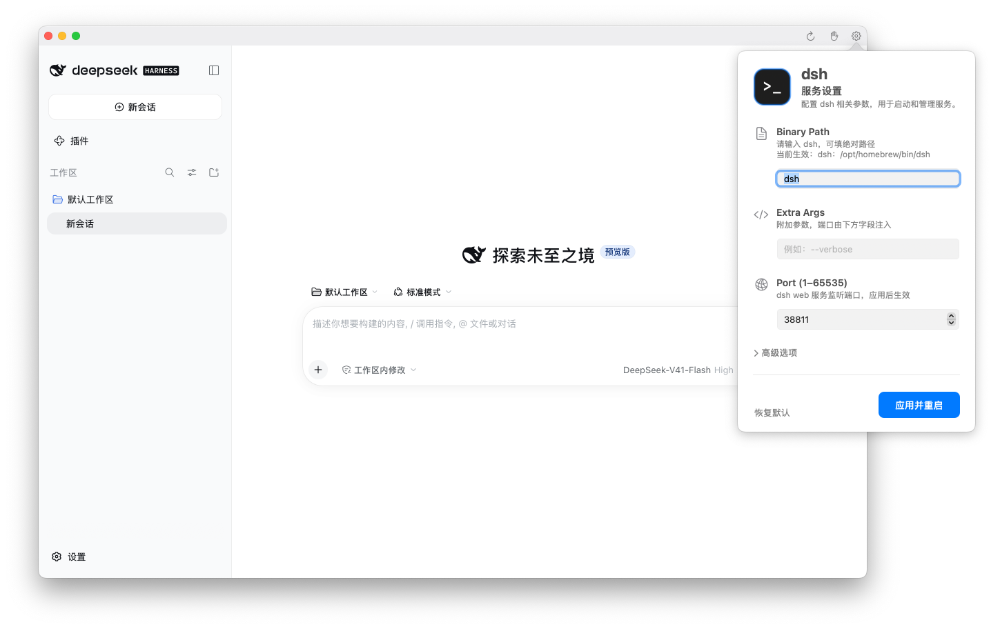

<div align="center">
  

  <h1 align="center">DshDock</h1>
</div>

<div align="center">


<a href="https://github.com/bitxeno/dsh-dock/blob/main/LICENSE">
</a>
<a href="https://github.com/bitxeno/dsh-dock/releases">
</a>

</div>


<div align="center">

[English](./README.md) | 中文

</div>

## DshDock

DshDock 是 macOS 上的 dsh 桌面应用，基于 AppKit + WebView 实现，体积小巧，无需浏览器。

<p align="center">
  
</p>

## 特性

- 支持设置 profile 和 DSH_HOME
- 兼容 dsh-market 插件重启处理

## 安装

### 安装官方 deepseek-harness

```
npm -g install @deepseek-ai/dsh
```

### Homebrew

```
brew install --cask bitxeno/tap/dshdock
```

### 直接下载

到 [Releases](https://github.com/bitxeno/dsh-dock/releases) 下载 `DshDock-<版本>.dmg`，拖进应用程序文件夹。

> 首次启动若被系统拦截（App 未公证）：右键 App 选"打开"。或执行 `xattr -dr com.apple.quarantine /Applications/DshDock.app`。

需要 macOS 15+。

## 使用

打开 App 就行，一切自动启动。

- **重启按钮**（标题栏 ↻）：页面卡住或空白时点它。
- **设置按钮**（标题栏齿轮）：一般不用管。
- 跳往外部页面的链接会自动用默认浏览器打开。

## 设置

绝大多数人保持默认即可。

| 设置项 | 默认值 | 什么时候改 |
|---|---|---|
| dsh 位置 | `dsh` | App 提示找不到 dsh、且你的 dsh 装在别处时才改 |
| 额外参数 | 空 | 高级用法，留空 |
| 端口 | `38811` | 和本机其他应用冲突时才改 |
| DSH_HOME（"高级选项"里） | 空 | 仅当 dsh 确实需要自定义 `DSH_HOME`；留空则启动完全不传该变量 |


---

## 开发

- 构建需要 Xcode 26 + `xcodegen`：`xcodegen generate`，再 `xcodebuild -project DshDock.xcodeproj -scheme DshDock -configuration Debug build`。
- 底层实际执行的是 `<binary> [web | --profile <名称>] --no-open --port <port> <extra>`——Extra Args 里填 `--profile <名称>` 会替换默认的 `web`；设置存在 `UserDefaults`（`dsh.binaryPath` / `dsh.extraArgs` / `dsh.port` / `dsh.dshHome`）。
- 详细设计：`docs/DESIGN.md`
